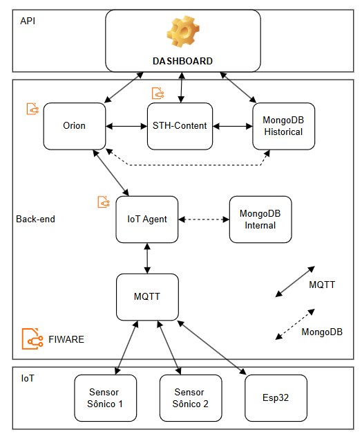

# ⚽ Sistema IoT de Monitoramento de Campo de Futebol

<div align="center">


_Sistema completo de monitoramento de condições ambientais para campos de futebol utilizando IoT e FIWARE_

</div>

---

## 📋 Sobre o Projeto

Este projeto implementa um **sistema completo de monitoramento IoT** para campos de futebol, utilizando o microcontrolador **ESP32** para coletar dados ambientais em tempo real e determinar se as condições do campo estão adequadas para a prática esportiva. Os dados são transmitidos para uma infraestrutura em nuvem baseada na plataforma **FIWARE** hospedada na **AWS** e visualizados através de um dashboard React interativo.

### ✨ Funcionalidades Principais

| Funcionalidade                  | Descrição                                             |
| ------------------------------- | ----------------------------------------------------- |
| 🌡️ **Temperatura**              | Monitoramento em tempo real via sensor DHT22          |
| 💧 **Umidade do Ar**            | Controle da umidade relativa ideal para jogos         |
| 💡 **Luminosidade**             | Medição das condições de iluminação do campo          |
| 🏟️ **Status do Campo**          | Indicador automático se o campo está apto para jogo   |
| 🔄 **Comunicação Bidirecional** | Controle remoto de iluminação via protocolo MQTT      |
| ☁️ **Cloud Computing**          | Dados processados e armazenados em infraestrutura AWS |
| 📊 **Dashboard Interativo**     | Visualização em tempo real com React + Vite           |
| 🐳 **Arquitetura FIWARE**       | Uso de componentes Orion, STH-Comet e MongoDB         |

### 🎯 Critérios de Aptidão do Campo

O sistema avalia automaticamente se o campo está apto para jogos baseado nos seguintes parâmetros:

| Parâmetro        | Faixa Ideal | Faixa Aceitável |
| ---------------- | ----------- | --------------- |
| **Temperatura**  | 15°C - 28°C | 10°C - 35°C     |
| **Umidade**      | 40% - 70%   | 30% - 80%       |
| **Luminosidade** | > 50% (dia) | > 30% (mínimo)  |

**Status do Campo:**

- 🟢 **APTO** - Todas as condições ideais
- 🟡 **ATENÇÃO** - Condições aceitáveis mas não ideais
- 🔴 **INADEQUADO** - Condições fora dos limites seguros

---

## 🏗️ Arquitetura do Sistema

<div style="max-width: 800px;">
  
</div>

### 📐 Componentes da Arquitetura

#### **Camada de Aplicação**

- **Dashboard React**: Visualização em tempo real das condições do campo
- **IA & Machine Learning**: Previsão de condições futuras
- **Mobile**: Aplicativo MyMQTT para gestores do campo
- **BigData**: Análise histórica de dados climáticos

#### **Camada de Backend (Docker)**

- **Orion Context Broker** (Porta 1026): Gerenciamento de contexto em tempo real
- **STH-Comet** (Porta 8666): Armazenamento de dados históricos
- **MongoDB** (Porta 27017): Banco de dados NoSQL
- **IoT Agent MQTT** (Porta 4041): Ponte entre dispositivos MQTT e FIWARE

#### **Camada IoT**

- **MQTT Broker** (Porta 1883): Servidor Mosquitto para comunicação
- **ESP32**: Microcontrolador com sensores DHT22, LDR e LED
- **Sensores**: Captação de dados ambientais do campo
- **Atuadores**: Controle de iluminação para feedback visual

---

## 🔧 Recursos Necessários

### Hardware (Físico ou Simulado)

- ESP32
- Sensor DHT22 (Temperatura e Umidade do ar)
- Sensor LDR (Luminosidade/Iluminação do campo)
- LED (Indicador visual de status)
- Resistores (10kΩ para LDR e 330Ω para LED)

### Software e Serviços

- **Arduino IDE**: Programação do ESP32 físico
- **Wokwi**: Simulador online de ESP32 (alternativa)
- **AWS EC2**: Máquina virtual na nuvem
- **Docker & Docker Compose**: Containerização dos serviços FIWARE
- **Postman**: Testes e configuração da API FIWARE
- **MyMQTT**: Aplicativo mobile (Android/iOS)
- **Node.js & npm**: Para rodar o dashboard React

---

## 🚀 Guia de Configuração

### Passo 1: Configurar o Circuito

#### 🔌 Tabela de Conexões

| Componente              | Pino ESP32                 | Observações                      |
| ----------------------- | -------------------------- | -------------------------------- |
| **DHT22**               |                            |                                  |
| VCC                     | 3.3V                       | Alimentação                      |
| GND                     | GND                        | Terra                            |
| DATA                    | GPIO 4                     | Leitura de temperatura e umidade |
| **LDR (Sensor de Luz)** |                            |                                  |
| Terminal 1              | 3.3V                       | Alimentação                      |
| Terminal 2              | GPIO 34 (ADC)              | Leitura analógica                |
| Terminal 2              | GND (via resistor 10kΩ)    | Divisor de tensão                |
| **LED**                 |                            |                                  |
| Ânodo (+)               | GPIO 2 (via resistor 330Ω) | Indicador de status              |
| Cátodo (-)              | GND                        | Terra                            |

#### 📝 Arquivos do Projeto

Os arquivos do circuito e código estão na pasta `devices/` do repositório:

- `sketch.ino` - Código do ESP32
- `diagram.json` - Configuração do circuito Wokwi

#### ⚙️ Configurar o Código

Abra o arquivo `sketch.ino` e **ajuste as seguintes linhas**:

**Para ESP32 Físico:**

```cpp
// Configure seu WiFi
const char* SSID = "SEU_WIFI";
const char* PASSWORD = "SUA_SENHA";

// IP público da sua VM AWS
const char* BROKER_MQTT = "SEU_IP_DA_VM_AWS";
const int BROKER_PORT = 1883;
```

**Para Simulação no Wokwi:**

```cpp
// WiFi do Wokwi (já vem configurado)
const char* SSID = "Wokwi-GUEST";
const char* PASSWORD = "";

// IP público da sua VM AWS
const char* BROKER_MQTT = "SEU_IP_DA_VM_AWS";
```

#### 🎯 Tópicos MQTT Utilizados

| Tópico                   | Tipo      | Descrição                    |
| ------------------------ | --------- | ---------------------------- |
| `/TEF/device001/cmd`     | Subscribe | Recebe comandos (LED ON/OFF) |
| `/TEF/device001/attrs`   | Publish   | Estado geral do dispositivo  |
| `/TEF/device001/attrs/s` | Publish   | Estado do LED (on/off)       |
| `/TEF/device001/attrs/l` | Publish   | Luminosidade (0-100%)        |
| `/TEF/device001/attrs/h` | Publish   | Umidade do ar (%)            |
| `/TEF/device001/attrs/t` | Publish   | Temperatura (°C)             |

---

### Passo 2: Configurar a VM AWS

#### 📦 2.1 - Criar Instância EC2

1. Acesse o **AWS Console**
2. Vá para **EC2 > Launch Instance**
3. Escolha **Ubuntu Server 22.04 LTS**
4. Tipo: **t2.medium** ou superior (recomendado para FIWARE)
5. Configure o **Security Group** com as seguintes portas:

| Porta | Protocolo | Descrição                         |
| ----- | --------- | --------------------------------- |
| 22    | TCP       | SSH                               |
| 1883  | TCP       | MQTT Broker (Mosquitto)           |
| 1026  | TCP       | Orion Context Broker              |
| 4041  | TCP       | IoT Agent MQTT                    |
| 8666  | TCP       | STH-Comet                         |
| 5173  | TCP       | Dashboard React (desenvolvimento) |

#### 🔗 2.2 - Conectar via SSH

```bash
ssh -i sua-chave.pem ubuntu@SEU_IP_PUBLICO
```

#### 📥 2.3 - Instalar Docker e Git

```bash
# Atualizar o sistema
sudo apt update && sudo apt upgrade -y

# Instalar Git
sudo apt install git -y

# Instalar Docker
curl -fsSL https://get.docker.com -o get-docker.sh
sudo sh get-docker.sh

# Adicionar usuário ao grupo docker
sudo usermod -aG docker $USER

# Instalar Docker Compose
sudo apt install docker-compose -y

# Reiniciar a sessão
exit
# Conecte novamente via SSH
```

#### 🐳 2.4 - Clonar e Executar o FIWARE

```bash
# Clonar o repositório FIWARE Descomplicado
git clone https://github.com/fabiocabrini/fiware.git

# Entrar na pasta
cd fiware

# Subir os containers
sudo docker compose up -d

# Verificar se os containers estão rodando
sudo docker ps
```

---

### Passo 3: Provisionar Dispositivos no FIWARE (Postman)

#### 📬 3.1 - Importar Collection no Postman

1. Baixe o arquivo de collection do repositório **FIWARE Descomplicado**
2. Abra o **Postman**
3. Clique em **Import** e selecione o arquivo

#### ✅ 3.2 - Health Check

```
GET http://SEU_IP_AWS:1026/version
```

#### 📡 3.3 - Provisionar Dispositivo

Execute a requisição **Provisionar Dispositivo** com este payload:

```json
{
  "devices": [
    {
      "device_id": "device001",
      "entity_name": "urn:ngsi-ld:Device:001",
      "entity_type": "Device",
      "protocol": "PDI-IoTA-UltraLight",
      "transport": "MQTT",
      "attributes": [
        { "object_id": "t", "name": "temperature", "type": "Float" },
        { "object_id": "h", "name": "humidity", "type": "Float" },
        { "object_id": "l", "name": "luminosity", "type": "Float" },
        { "object_id": "s", "name": "status", "type": "Text" }
      ],
      "commands": [
        { "name": "on", "type": "command" },
        { "name": "off", "type": "command" }
      ]
    }
  ]
}
```

#### 📝 3.4 - Registrar Comandos e Subscrição

Execute as requisições:

- **Registrar Comando ON**
- **Registrar Comando OFF**
- **Criar Subscription** (para STH-Comet)

#### 🧪 3.5 - Testar Leitura de Dados

Com o ESP32 rodando:

```
GET http://SEU_IP_AWS:1026/v2/entities/urn:ngsi-ld:Device:001
```

---

### Passo 4: Dashboard React

Agora vamos criar o dashboard para visualizar se o campo está apto!

O dashboard está em um artifact separado abaixo com instruções de instalação.

---

### Passo 5: Configurar o Aplicativo MyMQTT (Opcional)

#### 📱 5.1 - Instalar o MyMQTT

- **Android**: [Play Store](https://play.google.com/store/apps/details?id=at.tripwire.mqtt.client)
- **iOS**: [App Store](https://apps.apple.com/app/mymqtt/id1529660475)

#### 🔗 5.2 - Configurar Conexão

1. **Host**: `SEU_IP_DA_VM_AWS`
2. **Porta**: `1883`
3. **Conectar**

#### 📊 5.3 - Subscrever aos Tópicos

| Tópico                   | Descrição    |
| ------------------------ | ------------ |
| `/TEF/device001/attrs/t` | Temperatura  |
| `/TEF/device001/attrs/h` | Umidade      |
| `/TEF/device001/attrs/l` | Luminosidade |
| `/TEF/device001/attrs/s` | Status LED   |

#### 🎛️ 5.4 - Controlar o LED

- **Topic**: `/TEF/device001/cmd`
- **Message**: `device001@on|` ou `device001@off|`

---

## 📊 Interpretação dos Dados

### 🌡️ Temperatura

| Faixa       | Status        | Descrição                                |
| ----------- | ------------- | ---------------------------------------- |
| < 10°C      | 🔴 Inadequado | Muito frio - risco de lesões musculares  |
| 10°C - 15°C | 🟡 Atenção    | Frio - aquecimento prolongado necessário |
| 15°C - 28°C | 🟢 Ideal      | Condições ideais para prática esportiva  |
| 28°C - 35°C | 🟡 Atenção    | Calor - hidratação reforçada necessária  |
| > 35°C      | 🔴 Inadequado | Muito quente - risco de insolação        |

### 💧 Umidade

| Faixa     | Status        | Descrição                                 |
| --------- | ------------- | ----------------------------------------- |
| < 30%     | 🔴 Inadequado | Ar muito seco - desconforto respiratório  |
| 30% - 40% | 🟡 Atenção    | Ar seco - hidratação reforçada            |
| 40% - 70% | 🟢 Ideal      | Umidade ideal para jogos                  |
| 70% - 80% | 🟡 Atenção    | Ar úmido - sensação de abafamento         |
| > 80%     | 🔴 Inadequado | Muito úmido - dificuldade de transpiração |

### 💡 Luminosidade

| Faixa     | Status        | Descrição                             |
| --------- | ------------- | ------------------------------------- |
| < 30%     | 🔴 Inadequado | Iluminação insuficiente               |
| 30% - 50% | 🟡 Atenção    | Iluminação aceitável (jogos noturnos) |
| > 50%     | 🟢 Ideal      | Ótima visibilidade                    |

---

## 📚 Estrutura do Repositório

```
📦 projeto-campo-futebol-iot/
├── 📁 devices/
│   ├── sketch.ino          # Código do ESP32
│   └── diagram.json        # Circuito Wokwi
├── 📁 dashboard/
│   ├── src/
│   │   ├── App.jsx
│   │   └── components/
│   ├── package.json
│   └── vite.config.js
├── 📁 docs/
│   └── arquitetura.pdf
├── 📄 README.md
└── 📄 LICENSE
```

---

## 🎯 Casos de Uso

### ⚽ Gestores de Campos Esportivos

- Monitoramento em tempo real das condições do campo
- Decisão informada sobre liberação para jogos
- Histórico de condições ambientais

### 🏟️ Organizadores de Eventos

- Planejamento de partidas baseado em previsões
- Garantia de segurança dos atletas
- Cumprimento de normas de segurança esportiva

### 📊 Análise de Dados

- Identificação de padrões climáticos
- Otimização de horários para jogos
- Manutenção preventiva baseada em dados

---

## 📄 Licença

Este projeto está sob a licença MIT.

---

## 👥 Equipe Goal Breakers

- **Áurea Sardinha - 563837**
- **Eduardo Ulisses - 566339**
- **Henrique Guedes - 562474**
- **Laura Tigre - 565281**
- **Otávio Inaba - 565003**

---

<div align="center">

### ⭐ Se este projeto foi útil, considere dar uma estrela!

**Feito com ❤️ para a comunidade esportiva e IoT**

⚽ _"Tecnologia garantindo as melhores condições para o esporte"_

</div>
